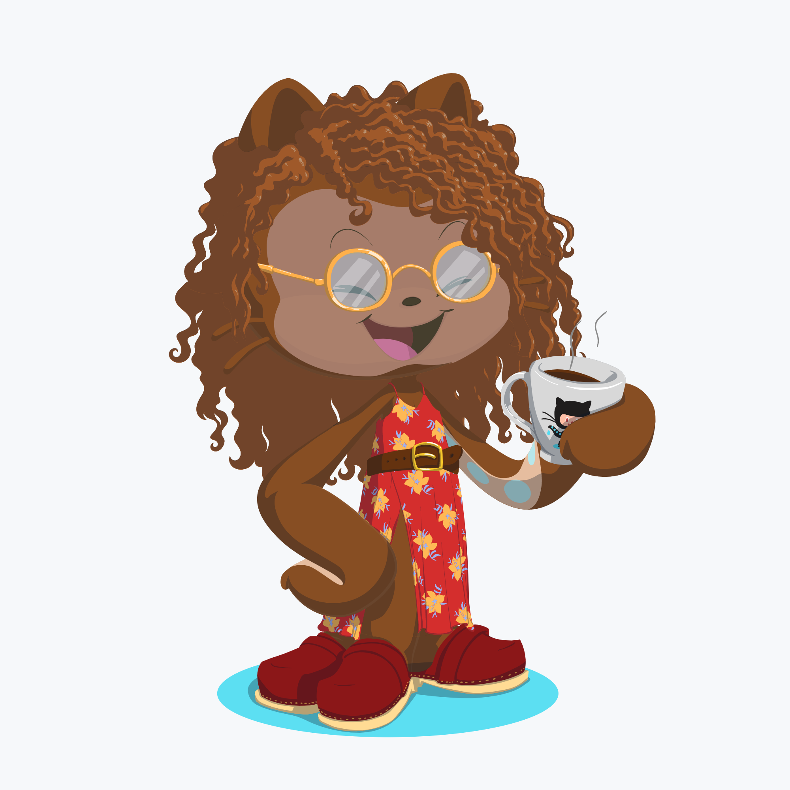

# Olá, Sou a Gabriela 🤟🏾

<h3> Pode me chamar de Gaby 🤗</h3>
 
<link rel="stylesheet" type="text/css" href="readme.css">

 </h2>
 
 
📚<em> Estudante de Análise e Desenvolvimento de Sistemas
 
 
💻<em> Focada em Front-end 
 
 
🏆<em> Aprimorandos estudos em bootcamps, meetups, lives...

  
  
  

 

 
 

## Contatos:
 

 

 

<!--
> Status do Projeto: Concluido :heavy_check_mark:

> Status do Projeto: Em desenvolvimento :warning:-->